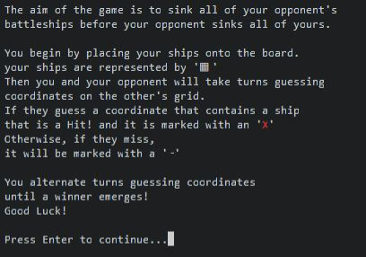
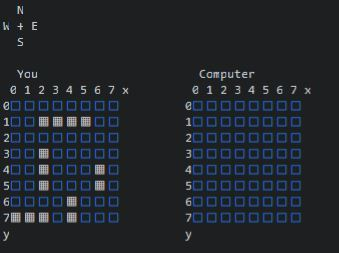

# Battleships

Battleships is a strategy guessing game where two players go head-to-head trying to sink the oppontnts ships before their ships are sunk. It is played on a grid of squares where each player takes turns guessing a coordinate on the grid, and the other player responds with 'Hit' or 'Miss'. The first player to correctly guess the position of the opposing player's ship is the winner.

# Table of Contents
* [User Experience](#user-experience)
    * [Site Goals](#site-goals)
    * [User Stories](#user-stories)
    * [Flow Design](#flow-design)
* [Features](#features)
    * [Title Screen](#title-screen)
    * [Rules](#rules)
    * [Board Size](#board-size)
    * [Place Ship](#place-ship)
    * [Ship Placement Validation](#ship-placement-validation)
    * [Game Board](#game-board)
    * [Win Screen](#win-screen)
    * [Smart Compuer Guessing](#smart-computer-guessing)
    * [Features to Implement](#features-to-implement)
* [Technologies](#technologies)
* [Testing](#testing)
    * [PEP8 Validation](#pep8-validation)
    * [Unfixed Bugs](#unfixed-bugs)
    * [Notable (Fixed) Bugs](#notable-fixed-bugs)
* [Deployment](#deployment)
    * [Version Control](#version-control)
    * [Clone the Repository Code Locally](#clone-the-repository-code-locally)
* [Credits](#credits)

# User Experience
## Site Goals
* To provide a fun strategy guessing game for the user to play in a terminal.
* To have an easy to navigate interface.
* To have a selection of game lengths for the user to choose from.

## User Stories
* As a user, I want a stratagy guessing game to play in a terminal.
* As a user, I want to play a shorter version of the game.
* As a user, I want to play a longer version of the game.
* As a user, I want my wins and losses to be tracked.

User Story:

> As a user, I want a stratagy guessing game to play in a terminal.

Acceptance Criteria:
* It should be clear that it is a game, and how to play.

Implementation:
* The first text that is displayed when the program is run is the title of the game, and then smaller text asking the user if they would like to see the rules on how to play.

User Story:

> As a user, I want to play a shorter version of the game.

> As a user, I want to play a longer version of the game.

Acceptance Criteria:
* The user should be able to change the length of the game with ease, either to a shorter version or a longer version.

Implementation:
* When the user starts the game, the first thing they are asked is the size of the board they want to play on, the smaller the board, the shorter the game is, and vice versa.

User Story:

> As a user, I want my wins and losses to be tracked.

Acceptance Criteria:
* The program should keep track of the user's wins and losses and display them to the user.

Implementation:
* After every completed game, the program keeps track of the user's wins and losses. it is displayed to them throughout the game, and is featured when they finish a game.

## Flow Design

# Features
## Title Screen
- Large text displaying the name of the game using pyfiglet.
- Welcome message.
- Gives user choice to see the rules, and provides them with their response options (y/n).

## Rules
- Clear to read rules.
- Shows what each symbol represents.
- Waits for user to press the enter key to continue.

## Board Size
- Provides user witht he option of the board size.
- They can choose between a large, medium and small board.
- The choices are displayed for the user (s, m, l).

## Place Ship

- Displays the game board, and any of the user's previously placed ships.
- Prompts user to select coordinates for the placement of their next ship, provides the coordinate range for the user to select from.
- Tells user the length of their next ship to place.
- After the user chooses the coordinates for ther ship, they will br prompted to choose a direction for the ship to be placed.
- Their direction options are displayed.
- There is a compass rose for the user to easily identify the directions.

v The user is about to place their first ship of length 4.

v The user has placed their first ship, and is about to place their next ship of length 3.

## Ship Placement Validation
There is robust input validation to ensure the user places their ships correctly on the board. The three types of validation are:

- Coordinate validation:
    - Prevents user selecting coordinates that are not on the board.
    - Prevents user selecting coordinates that have already been guessed.

    

    

- Direction validation:
    - Prevents user selecting a direction that would result in the ship segments being placed over an exsisting ship.
    - Prevents user selecting a direction that would result in the ship segments being placed outside the board.

    

    

- Placement area validation:
    - Prevents user from selecting coordinates of an area that would be too small for them to place a ship.
    - Only lets user select coordinates if the ship can be placed in al least one of the four directions.

    

## Game Board
- Compass rose for easily identifing the direction.
- Numbers along x and y axis for easily identifing the coordinated of a cell.
- Boards are titled and displayed in an easy to read fasion.
- User's ships clearly marked on their board.
    

The first turn of the game is randomly detirmined who goes first, user or computer. After both the player and computer have guessed. It will display the result of your guess (hit or miss), and display the computer's guess and result. The program will wait for the user to press the enter key to comtinue. 

Then, the game boards will update providing a visual representation of the guesses and results.

If either player guesses correctly, their result will be a hit. These are displayed as a red 'X' on the board.

## Win Screen
- Displays the final board state.
- Tells user who won the game.
- Tracks and displays the users wins and losses.
- Gives the user the option to play again.

## Score
- Game keeps track of user's score between games during the same session.
- The scores are displayed throughout the game, and are featured on the wil/lose screen.

## Smart Computer Guessing
In this game, you play against a computer. If the computer were to guess randomly, then it would be too easy to win. A solution to this was to improve the computer's decision making to add more of a challenge to the game.

To achieve this, the computer first starts by guessing randomly, as there is no information about the board yet.

The computer keeps guessing randomly until it gets a hit, then it will randomly guess one of the neighbouring tiles of the hit mark.

For any hit mark on the board, the computer randomly guesses one of it's unguessed neighbours. If all neighboring cells have been guessed, the computer will return to randomly guessing coordinates.

This process results in guesses clustered around hit marks and makes the computer feel smarter than just randomly guessing around the board, and makes for a more enjoyable gaming experience.

Example (these are computer guesses on the user's board):

## Features to Implement
One feature that I would like to implement would be feedback for when a player guesses all the segments of a shih and sinks the ship. I would like to add text that says "You have sunk their Destroyer" and alike. This would add to the game by providing positive feedback for when the user succesfully guesses multiple ship segments.